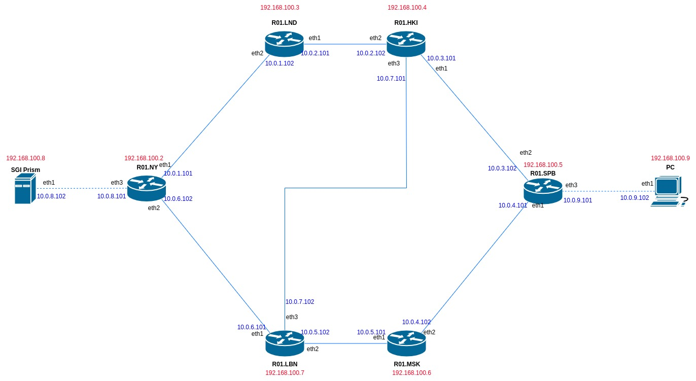
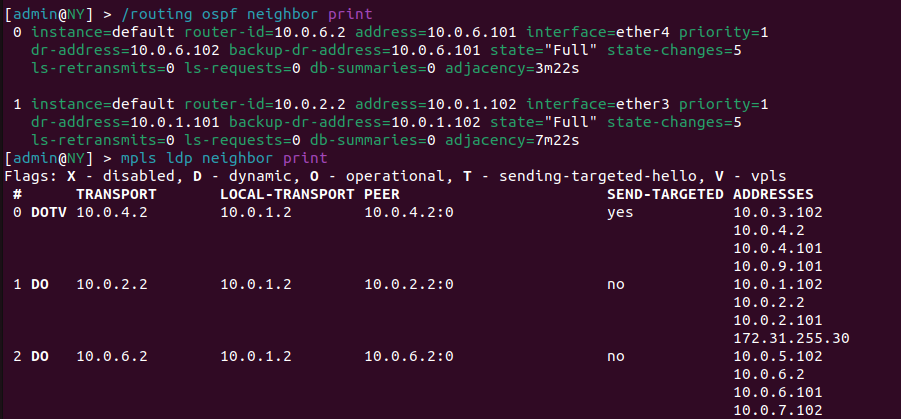
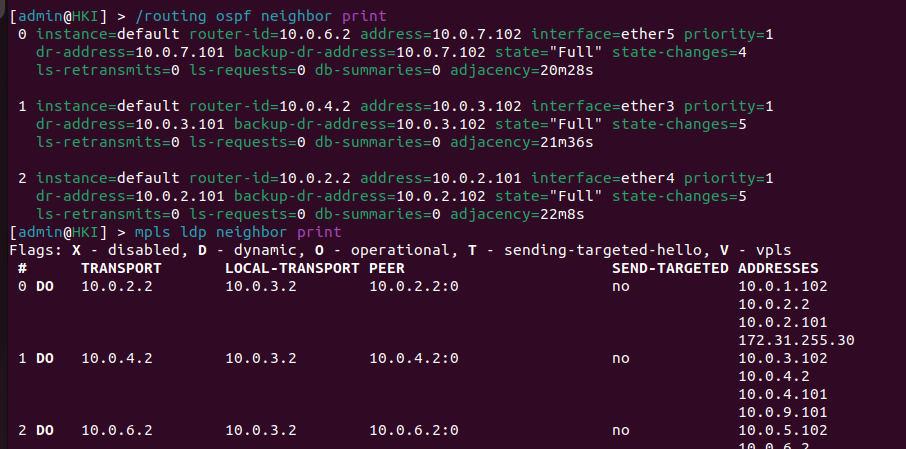
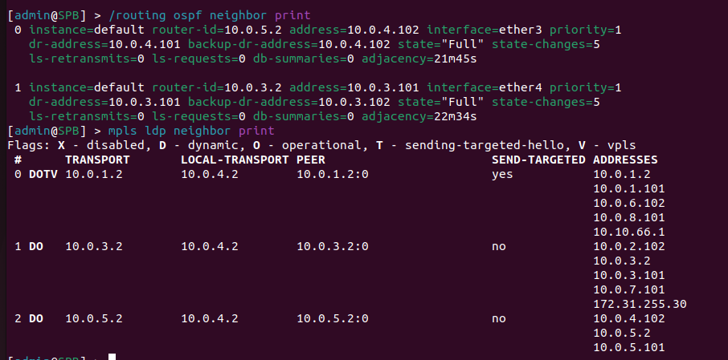
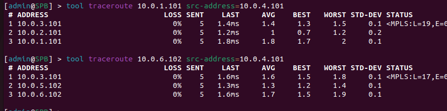
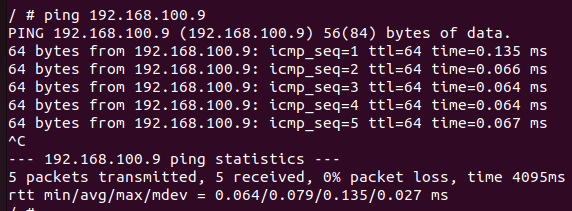

* *Курс: Введение в маршрутизацию на предприятии*

* *Студент: Маноменов Иван Андреевич*

* *Группа: К3323*

* *Дата сдачи: 18.12.24*

# Отчет по лабораторной работе №2 "Эмуляция распределенной корпоративной сети связи, настройка статической маршрутизации между филиалами"

## Цель работы
Изучить протоколы OSPF и MPLS.

## Задача

Требуется обеспечить коммуникацию между сервером в Нью-Йорке и компьютером в СПб через роутеры в различных точках (при этом есть различные варианты коммутации)
Нужно чтобы сотрудники из разных городов могли обмениваться файлами. Для этого требуется установить 3 роутера, назначить на них IP адресацию и поднять статическую маршрутизацию.

## Ход работы
Лабораторная работа выполнялась на компьютере с операционной системой Linux, оболочка Ubuntu 22.04.3

### Прописывание кофигураций

Были выбраны ip для портов и получена такая схема:

Далее были прописаны файлы конфигурации и файл топологии lab3.yml (прикреплены в директории)

*Примечание: файлы rsc по итогу почему-то не читались, и пришлось вбить все команды в терминале вручную*

 ### Проверка работы

Проверим, настроены ли mpls протоколы

Роутер NY:

Роутер HKI:

Роутер SPB:

Теперь посмотрим traceroute от СПб до Нью-Йорка с 2 разными портами в конце

Как мы видим, пакеты могут передаваться несколькими путями: и "сверху" (через Хельсинки и Лондон), и "снизу" (через Москву и Любляну)

Пинг сервера с компьютера:

Цель лабораторной работы была успешно выполнена: OSFP и MPLS протоколы успешно запущены

