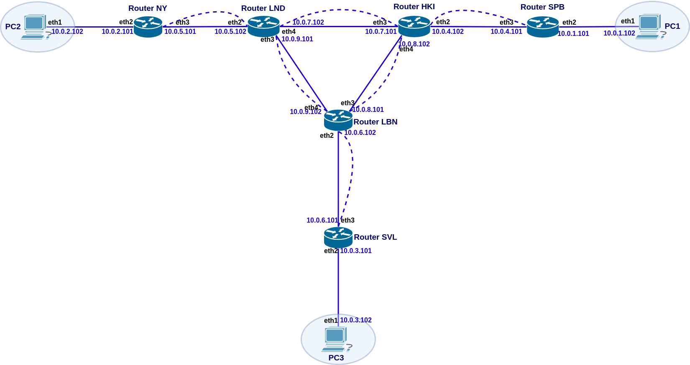
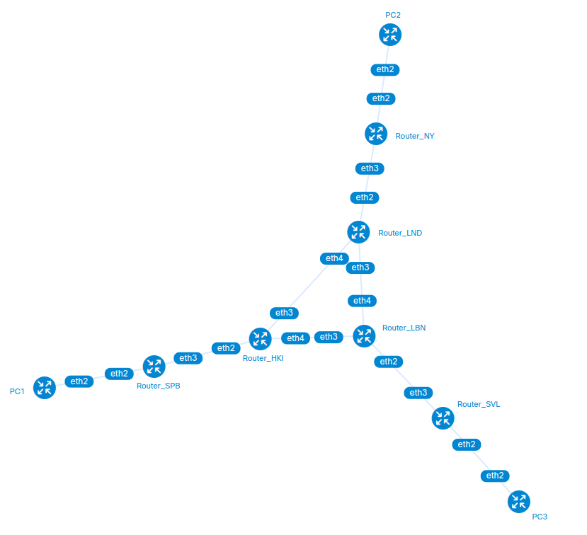
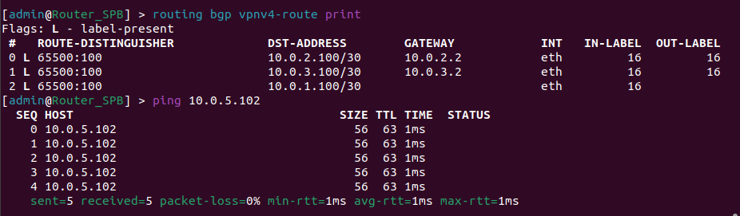
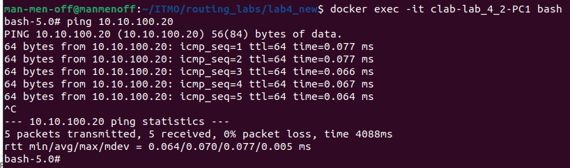
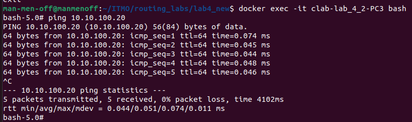

* *Курс: Введение в маршрутизацию на предприятии*

* *Студент: Маноменов Иван Андреевич*

* *Группа: К3323*

* *Дата сдачи: 25.12.24*

# Отчет по лабораторной работе №4 "Эмуляция распределенной корпоративной сети связи, настройка iBGP, организация L3VPN, VPLS"

## Цель работы
Изучить протоколы BGP, MPLS и правила организации L3VPN и VPLS

## Задача

Настроить L3VPN и VPLS на 3 удаленных компьютерах

## Ход работы
Лабораторная работа выполнялась на компьютере с операционной системой Linux, оболочка Ubuntu 22.04.3

### Часть 1:  IBGP и VRF
#### Прописывание кофигураций

Была выбрана следующая схема конфигурации с ip:

Был написан файл топологии lab4.yml и получен следующий результат:

Далее через интерфейсы роутеров они были настроены (файлы конфигурации в папке config1)

 #### Проверка работы

Проверим работу протоколов и связность сети

Router_SPB:

Router_NY:

Router_SVL:

Все работает

### Часть 2:  VPLS
#### Прописывание кофигураций

Топология несильно изменилась (была выбрана другая подсеть, чтобы можно было запускать обе версии без перезапуска контейнеров). Также через интерфейс были настроены IP компьютеров, а именно:
* PC-1 - 10.10.100.10
* PC-2 - 10.10.100.20
* PC-3 - 10.10.100.30
* 
Полные конфигурации в папке config2

 #### Проверка работы

Проверим работу протоколов и связность сети

PC1 пингует PC2:

PC2 пингует PC1:

PC3 пингует PC2:

Все работает

Цель лабораторной работы была успешно выполнена
